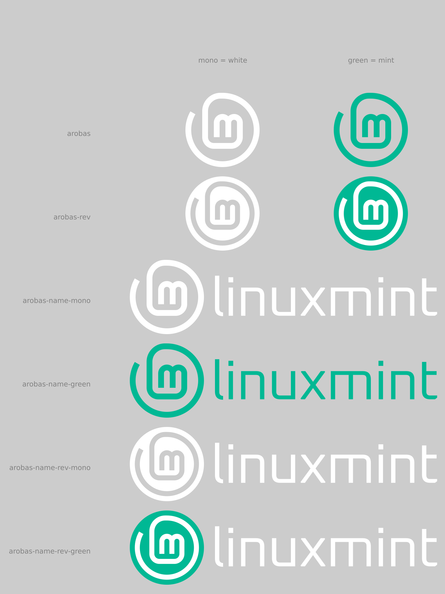

# brand-logo
Linux Mint Logo and brand resources

### etc branch
This `etc` branch is the experimental one. Here you can find new logos.

### Save as Plain SVG and use pixels (px) as units

All these files are saved as plain SVG (Inkscape > File > Save As... Plain SVG). This makes the files smaller without loosing any important data. Except one information: all units are in pixels. Everything was made using round numbers here. There is no such thing as `x=1.234 px` anywhere here. Prior to doing any edit, please set your document and tool units to pixels and use only round numbers.