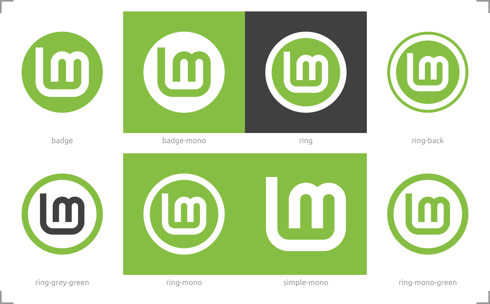

# brand-logo
Linux Mint Logo and brand resources


(Square backgrounds added here for preview)


(Rectangular backgrounds added here for preview)

### Save as Plain SVG and use pixels (px) as units
All these files are saved as plain SVG (Inkscape > File > Save As... Plain SVG). This makes the files smaller without loosing any important data. Except one information: all units are in pixels. Everything was made using round numbers here. There is no such thing as `x=1.234 px` anywhere here. Prior to doing any edit, please set your document and tool units to pixels and use only round numbers.

### Update the preview images for this README.md here
There are 2 preview files containing all the different logo versions. They are displayed with their names and suggested backgrounds. Those 2 preview files are made of links to the individual files. Thus, these **preview-1.svg** and **preview-names.svg** are always up-to-date. But you need to export them from Inkscape to PNG format to be able to see them here on GitHub. This way: Inkscape > File > Export PNG Image... Or you can also do this the CLI way:

```inkscape --export-type="png" preview-1.svg```

and

```inkscape --export-type="png" preview-names.svg```

(Tested with Inkscape version 1.1)