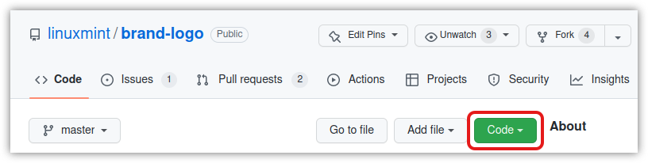

# Linux Mint logo and brand resources

▲ *Different logo variants pictured with different backgrounds.*

---

### 1. Download them all into a small ZIP

* Click on the green **Code** button on the top-right ↗ of the [main page](https://github.com/linuxmint/brand-logo) and then **Download ZIP.**
* Or clone it: `git clone https://github.com/linuxmint/brand-logo.git`.

### 2. Prefer SVG format whenever possible

SVG stands for Scalable Vector Graphics. They will always be displayed perfectly at any size, large or small. And these are the source files. They can be changed. You can easily change shapes or colors. And they are very lightweight, thus very fast on the internet.

### 3. How to modify or add new logo versions

#### 3.1. Change both the fill and the stroke color on the "linuxmint" name
If you want to change the color on any or all of the `ring-name*.svg` (logo+name) files, please be aware that the "linuxmint" name is made of a fill plus a stroke paint. That stroke thickness is added to increase the font weight. Thus, you need to change both the fill and the stroke color on the name or else you end up with a typography that gets "choked" by an outline overprint of different color. This:  

That's bad. To avoid this "choking" outline of different color, set the stroke paint to the same color as the one used for the fill. You can change both of those fill and stroke colors in the same Fill and Stroke dialog (Shift+Ctrl+F), under different tabs.

That was only for the "linuxmint" name. The "lm" logo itself has nothing special.

#### 3.2. Save as Plain SVG and use pixels as units
All these files are saved as plain SVG (Inkscape > File > Save As... Plain SVG). This makes the files smaller without loosing any important data. Except one information: all units are in pixels. Everything was made using round numbers here. There is no such thing as `x=1.234 px` anywhere here. Prior to doing any edit, please set your document and tool units to pixels and use only round numbers.

#### 3.3. Update those previews here on top of this README
The preview files are located in the `90-preview` sub-directory. The different logo versions that appear in `preview.svg` and `preview-names.svg` are placed there as a link. So, if you make changes to a logo that already exists, those changes are automatically applied in the SVG preview files. But you still have to update the PNG preview by an export. To get this, open Inkscape and do: File > Export page as PNG. Keep the same file name to replace the old PNG with your update.

Updating the preview for already existing logos is quick and easy. On the other hand, if you add or remove some logo version, you will have to edit the SVG preview file(s), and then export to PNG.