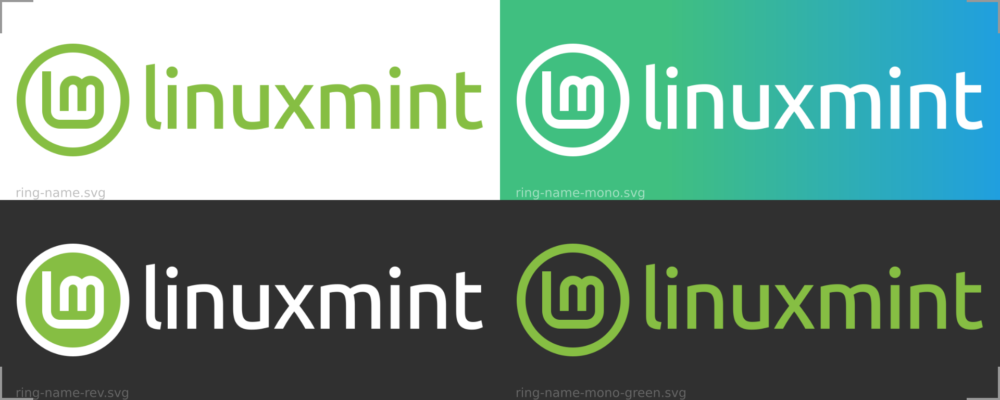

# brand-logo
Linux Mint logo and brand resources

▲ *Different logo variants pictured with different backgrounds*

---

### Download them all into a small ZIP

* Click on the green **Code** button on the top-right ↗ of the main page and then **Download ZIP.**
* Or clone it: `git clone https://github.com/linuxmint/brand-logo.git`.

### Prefer SVG format whenever possible

SVG stands for Scalable Vector Graphics. They will always be displayed perfectly at any size, large or small. And these are the source files. They can be changed. You can easily change shapes or colors. And they are very lightweight, thus very fast on the internet.

### Save as Plain SVG and use pixels as units

All these files are saved as plain SVG (Inkscape > File > Save As... Plain SVG). This makes the files smaller without loosing any important data. Except one information: all units are in pixels. Everything was made using round numbers here. There is no such thing as `x=1.234 px` anywhere here. Prior to doing any edit, please set your document and tool units to pixels and use only round numbers.